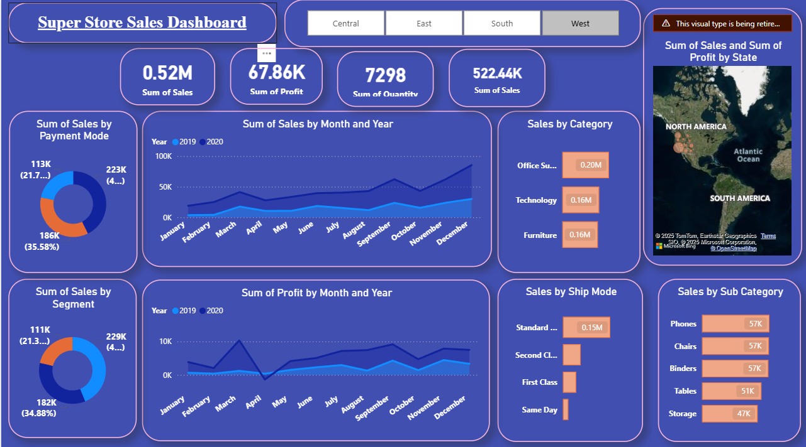

# Superstore Sales Dashboard

This is a **Power BI dashboard** visualizing Superstore sales data. It helps analyze sales trends, product performance, and regional performance.

## Files

- `Dashboard.pbix` – Power BI dashboard file  
- `data/superstore_sales.csv` – Dataset used in the dashboard  

## How to Use

1. Download or clone the repository.  
2. Make sure the CSV is in the `data/` folder.  
3. Open `Dashboard.pbix` in **Power BI Desktop**.  
4. Refresh the data to see the visualizations.  

## Notes

- The dashboard depends on the CSV file. Keep it in the same relative path (`data/`) when opening the `.pbix`.
- Dataset is for visualization purposes only.

Dashboard Preview:

